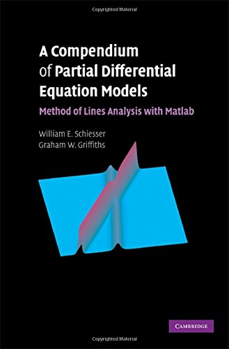
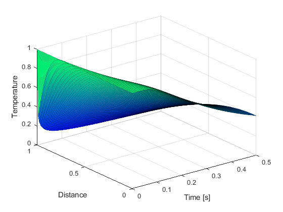
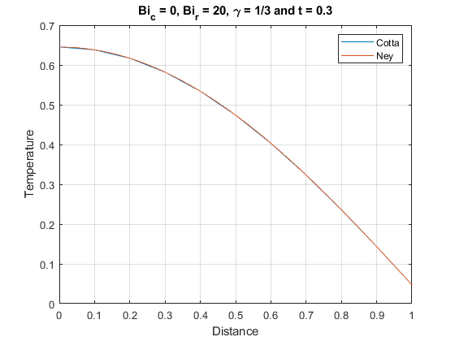

# numol

The present study served as an understanding of the method for future application in the final monograph of the mechanical engineering course.

## Folder book-schiesser2009

Studies on the numerical method of lines through the book "A Compendium of Partial Differential Equation Models" by William E. Schiesser and Graham W. Griffiths (Cambridge University Press).

ISBN-13 978-0-521-51986-1

All codes in this folder were based on the cited book.

## Folder paper-cotta2015

Solving partial differential equation with non-linear boundary conditions using the numerical method of lines.

The code was created by Thiago Ney Evaristo Rodrigues.

The equation was obtained from the article:
Cotta, R.M., Naveira-Cotta, C.P. and Knupp, D.C. (2016), "Nonlinear eigenvalue problem in the integral transforms solution of convection-diffusion with nonlinear boundary conditions", International Journal of Numerical Methods for Heat & Fluid Flow, Vol. 26 No. 3/4, pp. 767-789.
https://doi.org/10.1108/HFF-08-2015-0309

The results presented in the article were compared with those obtained in the study and can be seen below.

